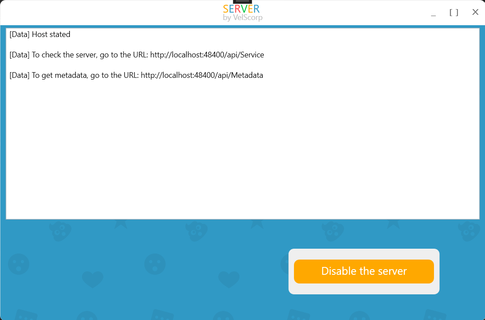

# WCF Chat Application v2

WCF Chat Application v2 is a modern, feature-rich chat application developed using Windows Communication Foundation (WCF). This application allows users to communicate in real-time, providing a robust platform for both one-on-one and group chats. It is designed to demonstrate the capabilities of WCF in building scalable and efficient communication applications.

## Features

### Real-time Messaging
- **Instant Messaging:** Send and receive messages in real-time.
- **Group Chats:** Create and manage group chats.
- **Message History:** Access and search through past conversations.

### User Management
- **User Registration:** New users can sign up and create an account.
- **User Authentication:** Secure login and authentication mechanisms.
- **User Profiles:** View and update user profiles.

### Notifications
- **Message Notifications:** Receive notifications for new messages.
- **Typing Indicators:** See when someone is typing a message.
- **Online Status:** View the online status of users.

### Administration
- **User Management:** Admins can manage user accounts.
- **Chat Moderation:** Admins can moderate chat rooms and messages.

## Project Structure

The project is organized into several projects:

- wcf_chat
  - Chat.Core
	- UI-independent logic and functionality
  - WPF.Core
	- Common WPF code and components
	- Refers to Chat.Core
  - Chat.Relational
	- Specific logic for working with SQLite 3 database 
	- Refers to Chat.Core
  - ChatHostWPF
	- UI and host specific logic
	- Refers to WPF.Core
  - ChatClient
	- UI and specific logic for the client
	- Refers to WPF.Core
  - Testing
	- UI and Api test cases
	- Refers to Chat.Relational, ChatHostWPF and ChatClient

## Screenshots

### Running Host


### Host Local Installation

1. Clone the repository:

```bash
git clone https://github.com/VelSkorp/wcf_chat-v2.git
```

2. Navigate to the project directory:

```bash
cd wcf_chat-v2\wcf_chat
```

3. Open the project in your preferred IDE (e.g., Visual Studio).

4. Build and run the application:
	- Set the ChatHostWPF project as the startup project
	- In Visual Studio, click on Build > Build Solution.
	- Once the build is complete, click on Debug > Start Debugging.

### Host Installation with Docker

1. Clone the repository:

```bash
git clone https://github.com/VelSkorp/wcf_chat-v2.git
```

2. Navigate to the dockerfile directory:

```bash
cd wcf_chat-v2\wcf_chat\ChatHostWPF\Docker
```

3. Build and run the Docker image:

```bash
docker build -t chathostwpf .
```

4. Run the Docker container:

```bash
docker run -p 80:80 chathostwpf
```

## Contributing

Contributions are welcome! Please submit issues or pull requests with any improvements, bug fixes, or new features.

## License

This project is licensed under the MIT License - see the [LICENSE](LICENSE) file for details.